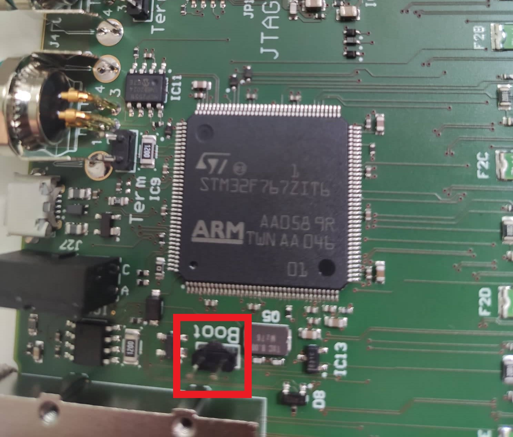

Preparation
+++++++++++

On this page you will find instructions on how to 
prepare MCORD HUB for work with boards.

HUB flesh
=========

Before you start uploading the software to 
MCORD HUB, you will need to prepare the following:

* A compiled micropython image adapted to the needs of the HUB in the .bin or .hex extension. 
  The finished image instance is available `here <https://github.com/kruksik-dev/MCORD_AFEHUB/>`_.
  
.. note::
  Currently, depending on the MCORD HUB generation, 
  it may have a different software version. 
  In newer versions of MCORD HUB ``micropython_1.16v_MK_Thread_DHCP.hex`` 
  has been flashed. Installing this version is recommended.

* Dedicated software stm32 microcontrollers for 
  uploading software to devices. An example of such software is `STM32CubeProgrammer <https://www.st.com/en/development-tools/stm32cubeprog.html>`_.

* Paper clip or the jumper to short the two pins on the hub.

Flashing instruction
--------------------

Disconnect the MCORD HUB from any power supply. Then use a paper clip to shorten 
the two pins marked ``boot`` on the HUB board (see the photo below).

Shorting these pins causes the Hub to switch to 
``Bootloader mode``. Connect the hub with the shorted
pins to the computer on which you have the stm32 
programmer installed. After connecting, you can open both pins, 
this operation is only needed when connected to the computer.

Then, using the software, upload the previously downloaded 
version of the micropython to the HUB.

.. tip::
    Before uploading a new software version, 
    it is recommended to completely erase the device memory 
    (previous software + files). This will prevent some functions and 
    files from being 
    incompatible between different versions of Micropython

After completing the HUB flashing, 
disconnect the device from the computer 
and the power source. Make sure that the ``boot`` pins are not 
short-circuited and then connect the power supply and the HUB to the 
computer. If everything is done successfully, the HUB should be detected 
as mass storage.

AFE flesh
=========

By default, AFE mounted on the ends of boards works in bootloader mode. This allows you to mofidy the AFE software
by directly connecting through the USB-C port located on the board. In order to upload a new software, connect using USB-C cable to AFE and use 
one of the STM32 programmer like `STM32Cube <https://www.st.com/en/development-tools/stm32cubeprog.html>`_. The update is done in the same way as you upload a newer version 
of the software to the HUB by removing the previous version from the memory and selecting the option to upload a new file in the side panel. You can find the latest AFE software directly 
here.

Loading files
=============

After uploading the appropriate version of 
Micropython to the HUB, you should upload to the device the 
appropriate scripts managing the operation of the device and the 
script responsible for launching the JSON server. 

All files are in the `repository <https://github.com/kruksik-dev/MCORD_AFEHUB/tree/main/Python_AFE_files>`_.

To do this, connect the device to the computer. 
When it is detected as mass storage, copy previously 
downloaded scripts directly to the device. 
After trying to connect to the device, e.g. 
through ``putty`` or ``minicom``, 
the scripts will not be visible immediately. 
Perform soft_reset of the device by calling

.. code-block:: python

   machine.soft_reset()
    

or using the hotkey ``ctrl + D``.

